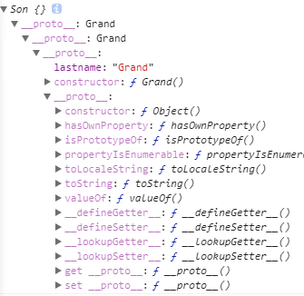

# javascript入门到放弃  
### 作用域与作用域链、执行上下文
***

> 作用域  

  定义：作用域是变量能够引用、函数能够生效的区域 ，它限制了你对内存空间上值的获取和修改 。
  所有的语言都存在作用域，我们可以理解作用域为js引擎根据名称查找变量的一套规则 。
  
  [[scope]]:每个javascript函数都是一个对象，对象中有些属性我们可以访问，
  但有些我们不能访问，这些属性仅供javascript引擎存取,[[scope]]就是其中一个。
  [[scope]]指的是我们所说的作用域，其中存储了执行上下文。 
  
> 作用域链

  定义：[[scope]]中所存储的执行上下文对象的集合，这个集合呈链式链接，我们把这种链式链接叫做作用域链。
  
> 执行上下文  

  定义：执行上下文可以理解为函数执行的环境，每一个函数执行时，都会给对应的函数创建这样一个执行环境。

### 闭包  
***

缺点： 当内部函数被保存到外部时，将会生成闭包。闭包会导致原有作用域链不释放，造成内存泄漏。

作用： 1.实现公有变量 2.可以做缓存 3.可以实现封装 4.模块化开发，防止污染全局变量  

```js
function test() {
  var arr = []
  for(var i = 0; i < 0; i ++) {
    arr[i] = function() {
      console.log(i + ' ')
    }
  }
  return arr
}
var myArr = test()
for(var j = 0; j < 10; j++) {
  myArr[j]() //10个10 ？？？？？？？？？？？？？
}
```

```js
function test() {
  var arr = []
  for(var i = 0; i < 0; i ++) {
    (function(j){
      arr[j] = function() {
        console.log(j + ' ')
      }
    })(i)
  }
  return arr
}
var myArr = test()
for(var j = 0; j < 10; j++) {
  myArr[j]() //0-9
}
```

### 原型、原型链、call、apply、继承  
***

> 原型

定义：原型是function对象的一个属性（Person.prototype），它定义了构造函数制造出的对象的公共祖先。
通过构造函数产生的对象，可以继承该原型的属性和方法。原型也是对象

```js
  // Person.prototype --原型
  // Person.prototype = {} -- 祖先
  person.lastname = '祖先'
  function Person(name) {
    // 隐式的声明，系统自己帮我们弄得。 let this = {__proto__: Person.prototype}
    this.name = name
  }
  let person = new Person('name')
  person.lastname // 组先
  person.constrcutor // 返回构造函数的构造器 function Person(){}
```
__proto__ 是一个指针指向对象的原型 person.prototype

> 原型链  

定义：当构造函数的prototypr属性指向一个构造函数实例时，这个实例和它指向的这个实例就构成了一条原型链，
通过__proto__逐级向上查找（就近原则），最顶层Object.__proto__。

```js
Grand.prototype.lastname = 'Grand'
function Grand() {}
let grand=new Grand()

Fanter.prototype = grand
function Fanter() {}
let father=new Fanter()

Son.prototype = fanter
function Son() {}
let son=new Son()
son.lastname // Grand
```



> call/apply
定义：改变this指向。区别：传参不一样。
```js
function Person(name, age) {
  //this = obj
  this.name = name
  this.age = age
}

// 本来son函数没有name和age调用Person.call(this,name, age)之后，son就拥有了person的功能
function Son(height,name, age) {
  Person.call(this,name, age) // Person.call() == Person() 借用别人的函数实现自己的功能 obj = {name:'tan',age:24,height:122}
  this.height = height
}
let son = new Son(100, 'tan', 24)
```
> 继承  
- 使用原型链继承。  
  缺点：过多的继承无用的属性。
 ```js
Grand.prototype.lastname = 'Grand'
function Grand() {}
let grand = new Grand()

Father.prototype = grand
function Father() {}
let father = new Father()

Son.prototype = Father
function Son() {}
let son = new Son()
son.lastname // Grand
 ```
- 使用构造函数（call/apply）继承。  
  缺点： 1.不能继承借用构造函数函数的原型。2.每次构造函数都要走一个函数  
 ```js
 function Person(name, age) {
  //this = obj
  this.name = name
  this.age = age
}
function Son(height,name, age) {
  Person.call(this,name, age)
  this.height = height
}
 ```
- 共享原型
  缺点：1.不能随便改动自己的原型。2.不能继承实例的东西
```js
  Fanter.prototype.lastname = 'fanter'
  function Father() {
    this.name = 'name'
  }
  function Son() {
  }
  Son.prototype = Father.prototype(如果改自己的原型，别人的原型也跟着改。因为指向同一个空间)
  let son = new Son()
  son.name // undefined
```
- 圣杯模式
```js
  function inherit(Target, Origin) {
    function F() {} // 中间层  
    F.prototype = Origin.prototype
    Target.prototype = new F()
    Target.prototype.constructor = Target // 归位子类constructor
    Target.prototype.super = Origin.prototype // 标记继承于谁
  }
  function Father() {}
  function Son() {}
  inherit(Son, Father)
  let son = new Son()
  let father = new Father()
```
> 命名空间
